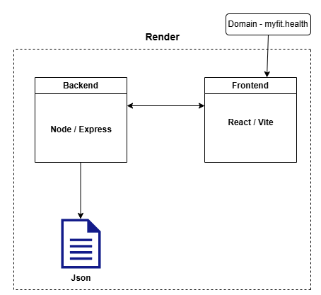

# 🏋️ myfit.health


**myfit.health** is a health and fitness tracking application designed to help users monitor their physical activities, health metrics, and personal goals. This document outlines the core functionality, architecture, technologies used, and development journey of the project.


---
## 📚 Table of Contents
- [MVP](#-mvp-minimum-viable-product)
- [Technologies Used](#-technologies-used)
- [Data Structure](#-data-structure)
- [Architecture Diagram](#-architecture-diagram)
- [Challenges & Lessons Learned](#-challenges--lessons-learned)
- [Developers](#-developers)
- [Future Improvements](#-future-improvements)

---

## 📌 MVP (Minimum Viable Product)

The MVP includes the following core features:

- ✅ Create a Single Page Application (SPA), using React, consisting of multiple views.
- ✅ The React application should be integrated with either a mock backend or an external API and should perform all CRUD (Create, Read, Update, Delete) operations on that API.
- ✅ Your project should be deployed online, allowing anyone to access and use your app.
- ✅ Have your project available on a GitHub repository. If your project includes a mock back-end API you should have two GitHub repositories - one for your front-end React application and the other for your back-end API.
- ✖️ Have at least 2 commits per day on your project repository that you worked on.
- ✅ As a final step, check all the features outlined in points 1 - 3 and ensure they are implemented and working ahead of delivery
---

  ## 📌 Extras

- Custom Domain 
- Responsive UI for mobile and desktop

---

## 🔧 Technologies Used

- **Frontend**: React.js / Vite  
- **Backend**: Node.js, Express.js  
- **Database**: Json File  
- **Authentication**: JWT / OAuth 2.0  
- **Styling**: CSS
- **Deployment**: Render 
- **Version Control**: Git + GitHub  

---

## 🧱 Data Structure

### User Schema (Json File)

```json
{
"id": 1746882543193,
"name": "Olivia Smith",
"age": 39,
"weight": 64,
"height": 165,
"gender": "female",
"activityLevel": "moderate",
"activityDescription": "Moderate exercise 3-5 days/week",
"bmiValue": "23.51",
"bmiCategory": "Normal weight",
"createdAt": "2025-05-10T13:09:03.193Z"
}
```

---
## 📐 Architecture Diagram



---

## 🚧 Challenges & Lessons Learned

- Time management is something that needs to be taken seriously.

- Be avoid of over engineering.

- Deploying in early stages will help you mitigate misconfigurations and bugs earlier.

---

## 👨‍💻 Developers
| Name | Role | GitHub |
| :---         |     :---:      |          ---: |
| Richard Nixon   | Fullstack Developer     | [@richardnixondev](https://github.com/richardnixondev)    |
| Kainat Naseer     | Fullstack Developer      | [@kainat-1](https://github.com/kainat-1)      |
		

---

## 📈 Future Improvements

🔐 Implement JWT refresh cycles and data encryption.

🧩 integration with third-party APIs.(Nutritionix)

⌚ Wearable sync (Apple Watch/Google Fit)

🤖 AI-driven goal recommendations

🏆 Social features (leaderboards, challenges)


## 🚀 Live Demo

https://myfit.health
